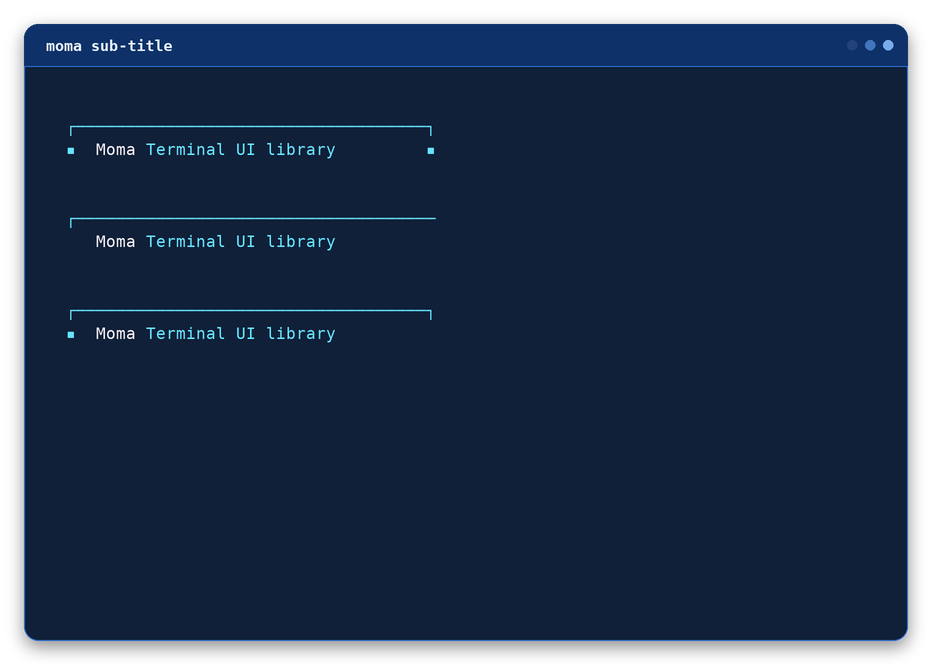
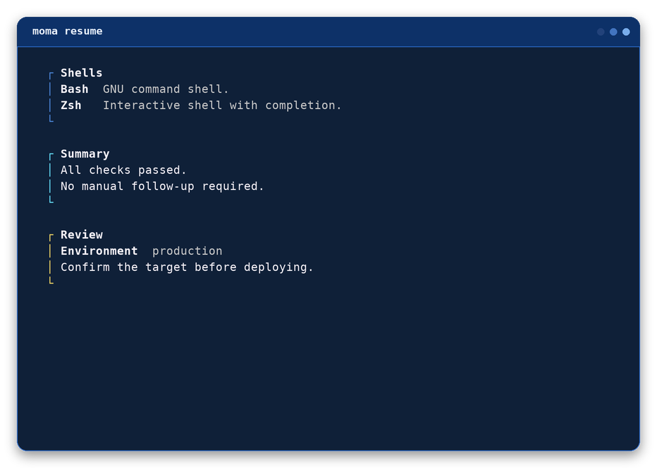
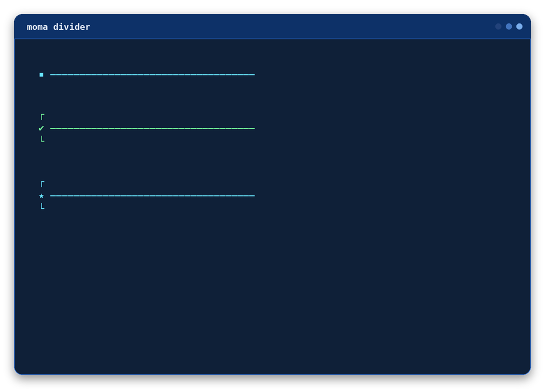

# Moma Documentation

Reference for the complete public Moma Bash API.

Repository: <https://github.com/Mgldvd/moma>

## Load the library

```bash
source dist/moma
```

Or install the executable and call the same command directly, without
sourcing anything:

```bash
moma msg "Ready" --success
```

Every command in this reference uses the canonical `moma <command>` syntax.
It works identically after `source dist/moma` (the sourced library defines
`moma` as a shell function) or once the executable is installed as `moma`.
Direct `moma-*` functions (for example `moma-msg`) remain available after
sourcing the library, for backward compatibility with existing scripts; see
[Backward compatibility](#backward-compatibility).

## Consistent decoration widths

Set `MOMA_WIDTH` once to give every horizontal decoration the same fixed inner
width, regardless of its text length.

```bash
export MOMA_WIDTH=50
moma box "Your configuration is ready." --success
moma box "Back up your files before continuing." --warning
```

Use `MOMA_MAX_WIDTH` when decorations should remain automatic but never exceed
a limit. Long content in boxes and static inputs wraps inside the border;
embedded labels are shortened with an ellipsis when necessary.

```bash
unset MOMA_WIDTH
export MOMA_MAX_WIDTH=50
```

Fixed width takes priority when both variables are set. The decorated
components `moma-title`, `moma-title-sub`, `moma-sub-title`, `moma-box`,
`moma-prompt`, `moma-label`, `moma-input`, `moma-resume`, and
`moma-divider` also accept local `--width` and `--max-width` options. A
local fixed width overrides the global setting. The minimum effective
decoration width is 8 columns; box padding can require more.

## Color themes

Moma loads `~/.config/momaui/moma.confg` when it exists. The file is
declarative and requires a complete `[theme default]` section.

```ini
[colors]
violet = \033[38;2;189;147;249m
orange = \033[38;2;255;184;108m

[theme default]
primary = cyan
accent = yellow
muted = gray
success = green
error = red
warning = yellow
info = cyan

[theme night]
primary = violet
accent = orange
```

List or select themes with the standalone CLI.

```bash
moma themes
moma --theme night msg "Ready"
MOMA_THEME=night moma msg "Ready"
```

Export `MOMA_THEME` before sourcing the library to select a theme for public
functions. Additional themes inherit omitted roles from `default`. Custom
colors become valid component-level `--color` values. Set `MOMA_CONFIG_FILE`
to load another path. Explicit `MOMA_COLOR_*` variables take priority over
configured values.

## Visual components

### `moma-header`

Three-line Pagga ASCII heading for a prominent script or workflow identity.
Letters are rendered in uppercase; unsupported characters use `?`.
`--margin-top` adds empty lines before the heading and defaults to `1`.
`--margin-bottom` adds empty lines after it and defaults to `2`; use `0` for
either value to disable that spacing.
`--margin-left` indents every heading row and defaults to `0`.

```text
moma header "TEXT" [--color color] [--margin-top number] [--margin-bottom number] [--margin-left number] [--no-color]
```

```bash
# Example 1
moma header "Moma"

# Example 2
moma header "Deploy 2026" --color cyan --margin-top 0 --margin-bottom 1 --margin-left 2
```

### `moma-title`

Primary identity block for the beginning of a script or major workflow. The
left marker defaults to `▪` and can be swapped for a semantic icon or
dropped in favor of a plain box edge; the right marker independently
mirrors it, closes with a plain edge, or is dropped entirely.

```text
moma title "Moma" "Terminal UI library" [--success|--error|--warning|--info] [--primary color] [--accent color] [--icon char] [--no-icon] [--border mirror|line|open] [--width number] [--max-width number]
```

```bash
# Example 1
moma title "Moma" "Terminal UI library"

# Example 2
moma title "Deploy" "Production" --primary cyan

# Example 3
moma title "Backup" "Nightly job" --accent yellow --min-width 48

# Example 4: semantic icon, plain right edge
moma title "Moma" "Terminal UI library" --success --border line

# Example 5: no marker at all, open right edge
moma title "Moma" "Terminal UI library" --no-icon --border open
```


### `moma-title-sub`

Secondary heading for stages nested inside the main workflow. The left
marker defaults to `▪` and can be swapped for a semantic icon or dropped
in favor of blank filler (there's no left box edge to fall back to here,
unlike `moma-title`); `--border` controls the closing line the same way
it does on `moma-title` and `moma-resume`.

```text
moma title-sub "Deployment" "Production environment" [--success|--error|--warning|--info] [--color color] [--icon char] [--no-icon] [--border mirror|line|open] [--width number] [--max-width number]
```

```bash
# Example 1
moma title-sub "Dependencies" "Installing packages"

# Example 2
moma title-sub "Deploy" "Production" --color cyan

# Example 3
moma title-sub "Tests" --message "Running suite" --min-width 42

# Example 4: closed underline, marker mirrored at the end of the line
moma title-sub "Dependencies" "Installing packages" --border mirror
```


### `moma-sub-title`

Rule-first secondary heading: the same marker/padding line as
`moma-title-sub`, but with the rule printed above the text instead of
below it, and no closing row. `--icon`/`--no-icon`/semantic flags and
`--border mirror|line|open` work the same way as on `moma-title-sub`,
except `--border` controls whether the *top* rule closes with a `┐`.

```text
moma sub-title "Moma" "Terminal UI library" [--success|--error|--warning|--info] [--color color] [--icon char] [--no-icon] [--border mirror|line|open] [--min-width number] [--width number] [--max-width number]
```

```bash
# Example 1: default - closed rule, marker mirrored at both ends
moma sub-title "Moma" "Terminal UI library"

# Example 2: open rule, no marker at all
moma sub-title "Moma" "Terminal UI library" --no-icon --border open

# Example 3: closed rule, single left marker only
moma sub-title "Moma" "Terminal UI library" --border line
```



### `moma-section`

Strong separator that gives semantic context to the content that follows.

```text
moma section "Dependencies ready" --success
```

```bash
# Example 1
moma section "Dependencies ready" --success

# Example 2
moma section "Configuration failed" --error

# Example 3
moma section "Next step" --info --icon "→"
```


### `moma-msg`

Compact feedback with semantic defaults or custom color and icon overrides.

```text
moma msg "Package installed" --success [--color value] [--icon value]
```

```bash
# Example 1
moma msg "Package installed" --success

# Example 2
moma msg "Connection refused" --error

# Example 3
moma msg "Downloading metadata" --color cyan --icon "→"
```


### `moma-msg-simple`

A quiet message with only a dot marker and no semantic icon.

```text
moma msg-simple "Package installed" [--success|--error|--warning|--info] [--color value]
```

```bash
# Example 1
moma msg-simple "Package installed"

# Example 2
moma msg-simple "Package installation failed" --error

# Example 3
moma msg-simple "Queued" --color yellow --marker "•"
```


### `moma-list`

An unordered terminal list with a consistent marker for every item.

```text
moma list "Clone repository" "Install dependencies" [--success|--error|--warning|--info]
```

```bash
# Example 1
moma list "Clone repository" "Install dependencies" "Start application"

# Example 2
moma list "Database ready" "Cache ready" --success

# Example 3
moma list "Review logs" "Retry deployment" --marker "→" --color yellow
```


### `moma-box`

Framed notice for information that must stand apart from surrounding output.

```text
moma box "Configuration is ready." --success [--width number] [--max-width number]
```

```bash
# Example 1
moma box "Configuration is ready." --success

# Example 2
moma box "Review the deployment settings." --warning --width 48

# Example 3
moma box "Build failed." --error --icon "✖" --padding 2

# Same fixed width for multiple boxes
moma box "Configuration is ready." --success --width 50
moma box "Back up your files before continuing." --warning --width 50
```


### `moma-resume`

Titled, colored content block for grouping related information, such as a
résumé section or a categorized reference list. Rows come from repeated
`--item` (a bold term next to a muted description, aligned as a column) and
`--text` (a plain line) flags, interleaved in the order given. One blank
line follows the block, so calling `moma-resume` repeatedly stacks blocks
with consistent spacing.

The title is a single open line by default (`┌─ Title`). Setting `--icon`,
`--no-icon`, or a semantic flag switches to a boxed header instead: a
full-width top border, a marker + title line, and a blank separator row
before the content rows - mirroring `moma-title`'s own marker conventions.
`--border` controls the closing edge the same way it does on `moma-title`:
`mirror` and `line` (default: `mirror`) close with `└`, `open` leaves the
block unclosed.

```text
moma resume --title "<text>" [--item "<term>" "<description>"]... [--text "<line>"]... [--success|--error|--warning|--info] [--color color] [--icon char] [--no-icon] [--border mirror|line|open] [--width number] [--max-width number] [--no-color]
```

```bash
# Example 1: a definition list, each block its own color
moma resume --title "Shells and Terminal Experience" --color blue \
  --item "Bash" "GNU command shell and scripting environment." \
  --item "Zsh" "Interactive shell with advanced completion and customization."
moma resume --title "Files, Search, and Data Processing" --color pink \
  --item "ripgrep" "Fast recursive text-search utility." \
  --item "jq" "Command-line JSON query and transformation processor."

# Example 2: plain text rows instead of a definition list
moma resume --title "Summary" --color cyan \
  --text "All checks passed." \
  --text "No manual follow-up required."

# Example 3: semantic color and mixed row kinds - the semantic flag also
# switches on the boxed header
moma resume --title "Review" --warning \
  --item "Environment" "production" \
  --text "Confirm the target before deploying."

# Example 4: boxed header, no marker, left unclosed
moma resume --title "Moma Terminal UI library" --no-icon --border open \
  --text "element 1" \
  --text "element 2"
```



### `moma-divider`

Marker-led horizontal rule, for separating sections without a full
heading. Uses `—` (em dash) instead of the `─` box-drawing character
elsewhere in Moma, and has no left box edge, only an optional bare
`┌`/`└` pair framing the rule above and below. `--icon`, `--no-icon`, and
the semantic flags work the same way as on `moma-title-sub`; `--border`
open (default) prints just the rule, while `line` and `mirror` both
frame it.

```text
moma divider [--success|--error|--warning|--info] [--color color] [--icon char] [--no-icon] [--border mirror|line|open] [--min-width number] [--width number] [--max-width number] [--no-color]
```

```bash
# Example 1: default - a bare rule, no frame
moma divider

# Example 2: framed, semantic icon
moma divider --success --border line

# Example 3: framed, custom icon
moma divider --icon "⏻" --border line
```



### `moma-prompt`

Question lead-in used before confirmation or free-form interaction.

```text
moma prompt "Continue with the installation?" --color pink [--width number] [--max-width number]
```

```bash
# Example 1
moma prompt "Continue with the installation?"

# Example 2
moma prompt "Select an environment" --color cyan

# Example 3
moma prompt "Deploy now?" --default "yes" --icon "?"
```


### `moma-label`

Print an input-style decorated label with automatic width, semantic color support, and one blank line below it.

```text
moma label "TEXT HERE" [--width number] [--max-width number] [--color color] [--icon symbol]
```

```bash
# Example 1
moma label "PROJECT NAME"

# Example 2
moma label "DEPLOYMENT" --success

# Example 3
moma label "NOTES" --width 52 --color cyan --icon "→"
```


### `moma-rabbit`

Branded activity and completion feedback using Moma's rabbit signature.

```text
moma rabbit "Preparing workspace" --info
```

```bash
# Example 1
moma rabbit "Preparing workspace" --info

# Example 2
moma rabbit "Deployment complete" --success

# Example 3
moma rabbit "Build needs attention" --warning --icon "!"
```


## Interactive components

### `moma-input`

Display or read a field with placeholders, validation, secret masking, and one blank line below each interactive value.

```text
moma input --title "Project name" --read --required [--secret] [--mask symbol] [--default value] [--width number] [--max-width number]
```

```bash
# Example 1
moma input --title "Project name" --placeholder "my-project"

# Example 2
project="$(moma input --title "Project name" --read --required --trim)"

# Example 3
password="$(moma input --title "Password" --read --secret --required)"
```


### `moma-single-select`

Select one value with the arrow keys, return it through standard output, and leave one blank line below the controls. Each row shows a radio indicator: `◉` for the focused selection and `○` for every other option.

```text
moma single-select "Development" "Staging" "Production" [--title text] [--initial number]
```

```bash
# Example 1
environment="$(moma single-select "Development" "Staging" "Production" --title "Environment")"

# Example 2
environment="$(moma single-select "Development" "Staging" "Production" --choose 2)"

# Example 3
region="$(moma single-select "US" "EU" "APAC" --title "Region" --initial 2 --color cyan)"
```


### `moma-select`

Documented compatibility alias for `moma-single-select`. It accepts the same arguments, renders identically, and remains available for existing scripts and the `select` CLI command.

```bash
environment="$(moma select "Development" "Staging" "Production" --title "Environment")"
```

### `moma-single-select-groups`

Select one value organized under named, non-selectable group headings. Repeat `--group <name>` followed by one or more `--option <value>` pairs; `--initial` and `--choose` use one-based indexes that count only options, in visual order across every group.

```text
moma single-select-groups --title text (--group name --option value...)... [--initial number] [--choose number]
```

```bash
# Example 1
action="$(
  moma single-select-groups \
    --title "Features" \
    --group "Docker" --option "Up" --option "Down" --option "Stop" \
    --group "npm" --option "install" --option "run dev" --option "run deploy"
)"

# Example 2 (--choose 4 selects "install", the first option of the second group)
action="$(
  moma single-select-groups \
    --title "Features" \
    --group "Docker" --option "Up" --option "Down" --option "Stop" \
    --group "npm" --option "install" --option "run dev" --option "run deploy" \
    --choose 4
)"
```

### `moma-multi-select`

Toggle multiple values below a decorated Moma heading and return every selection on its own line, in original visual order. Each row shows a checkbox indicator: `▣` when selected and `□` when not. When the list is taller than the terminal, interactive navigation scrolls a fixed-size window and shows a "N more above/below" line instead of losing track of the active row; `--choose` always renders every option, unwindowed.

```text
moma multi-select "Docker" "CI" "Tests" [--selected 1,3] [--required]
```

```bash
# Example 1
features="$(moma multi-select "Docker" "CI" "Tests" --title "Features")"

# Example 2
features="$(moma multi-select "Docker" "CI" "Tests" --choose 1,3)"

# Example 3
features="$(moma multi-select "Docker" "CI" "Tests" --selected 1,2 --required)"
```


### `moma-multi-select-groups`

Toggle multiple values organized under named, non-selectable group headings and return every selection on its own line, in original visual order. Repeat `--group <name>` followed by one or more `--option <value>` pairs; `--selected` and `--choose` use comma-separated, one-based indexes that count only options, in visual order across every group. Each group gets a focusable "All" row that toggles every option in that group, and a "Select All" row above the first group toggles every option across all groups; neither counts as an option or appears on stdout. When the full layout is taller than the terminal, interactive navigation switches to a compact scrolling window with a "N more above/below" line: heading text is dropped and each group's All row is labeled with its group name instead, but the blank line between groups stays, so every option remains reachable, selectable, and visually grouped; `--choose` always renders the full layout, unwindowed.

```text
moma multi-select-groups --title text (--group name --option value...)... [--selected numbers] [--choose numbers] [--required]
```

```bash
# Example 1
countries="$(
  moma multi-select-groups \
    --title "Features" \
    --group "North America" --option "United States" --option "Canada" --option "Mexico" \
    --group "South America" --option "Colombia" --option "Argentina" --option "Peru"
)"

# Example 2
countries="$(
  moma multi-select-groups \
    --title "Features" \
    --group "North America" --option "United States" --option "Canada" --option "Mexico" \
    --group "South America" --option "Colombia" --option "Argentina" --option "Peru" \
    --choose 1,3 --required
)"
```

### `moma-confirm`

Select Yes or No with the arrow keys, Enter, or the y and n shortcuts. A successful answer leaves one blank line below the controls.

```text
moma confirm "Create this project?" [--default yes|no] [--answer yes|no]
```

```bash
# Example 1
moma confirm "Create this project?" --default yes

# Example 2
moma confirm "Delete the cache?" --answer no

# Example 3
if moma confirm "Deploy now?"; then
  moma msg "Deploying" --info
fi
```


## Workflow helpers

### `moma-spinner`

Display progress while a process is active, then print semantic completion feedback.

```text
moma spinner pid ["message"] [--delay seconds]
```

```bash
# Example 1
sleep 2 &
moma spinner "$!" "Waiting"

# Example 2
backup_database &
moma spinner --pid "$!" --message "Backing up"

# Example 3
build_project &
moma spinner "$!" "Building" --delay 0.05
```


### `moma-command-check`

Check whether every requested executable is available and return a useful status.

```text
moma command-check bash curl git [--quiet]
```

```bash
# Example 1
moma command-check bash curl git

# Example 2
moma command-check docker --quiet

# Example 3
if ! moma command-check git; then
  exit 1
fi
```


## Semantic styles

| Flag | Default color | Default icon |
| --- | --- | --- |
| `--success` | Green | `✔` |
| `--error` | Red | `✖` |
| `--warning` | Yellow | `!` |
| `--info` | Cyan | `→` |

## Preview commands

```bash
moma preview
moma preview md
moma preview web
moma help
```

`preview web` opens the hosted Moma documentation website
(`https://mgldvd.github.io/moma/`) in the default browser using `open` on
macOS or `xdg-open` on Linux. It does not start a local server or require
Python.

## Version and updates

```bash
moma version
moma --version
moma -v
moma update
```

`version`, `--version`, and `-v` all print the same canonical version string
and exit `0`. `--version` and `-v` are recognized only as leading arguments,
before a command is selected.

`update` downloads the latest executable, validates it, and atomically replaces
the current executable. It requires `curl` and write permission for the installed
file and its directory, so it must run from an executable installation.

## Backward compatibility

Every public component also has a direct `moma-*` function (for example
`moma-msg-simple`, `moma-single-select`, `moma-confirm`) available once
`dist/moma` is sourced. These functions are the same implementation the
`moma <command>` dispatcher calls, so behavior is identical; they remain
supported so existing scripts keep working without changes, but new scripts
should use the canonical `moma <command>` form shown throughout this
reference.

```bash
source dist/moma

moma msg-simple "Package installed"   # recommended
moma-msg-simple "Package installed"   # legacy, still supported
```

## Remote preview

```bash
bash <(curl -fsSL https://raw.githubusercontent.com/Mgldvd/moma/master/dist/moma) preview
```
