# Moma Documentation

Reference for the complete public Moma Bash API.

Repository: <https://github.com/Mgldvd/moma>

## Load the library

```bash
source dist/moma
```

## Consistent decoration widths

Set `MOMA_WIDTH` once to give every horizontal decoration the same fixed inner
width, regardless of its text length.

```bash
export MOMA_WIDTH=50
moma-box "Your configuration is ready." --success
moma-box "Back up your files before continuing." --warning
```

Use `MOMA_MAX_WIDTH` when decorations should remain automatic but never exceed
a limit. Long content in boxes and static inputs wraps inside the border;
embedded labels are shortened with an ellipsis when necessary.

```bash
unset MOMA_WIDTH
export MOMA_MAX_WIDTH=50
```

Fixed width takes priority when both variables are set. The decorated
components `moma-title`, `moma-title-sub`, `moma-box`, `moma-prompt`,
`moma-label`, and `moma-input` also accept local `--width` and `--max-width`
options. A local fixed width overrides the global setting. The minimum
effective decoration width is 8 columns; box padding can require more.

## Color themes

Moma loads `~/.config/momaui/moma.confg` when it exists. The file is
declarative and requires a complete `[theme default]` section.

```ini
[colors]
violet = \033[38;2;189;147;249m
orange = \033[38;2;255;184;108m

[theme default]
primary = cyan
accent = yellow
muted = gray
success = green
error = red
warning = yellow
info = cyan

[theme night]
primary = violet
accent = orange
```

List or select themes with the standalone CLI.

```bash
moma themes
moma --theme night msg "Ready"
MOMA_THEME=night moma msg "Ready"
```

Export `MOMA_THEME` before sourcing the library to select a theme for public
functions. Additional themes inherit omitted roles from `default`. Custom
colors become valid component-level `--color` values. Set `MOMA_CONFIG_FILE`
to load another path. Explicit `MOMA_COLOR_*` variables take priority over
configured values.

## Visual components

### `moma-header`

Three-line Pagga ASCII heading for a prominent script or workflow identity.
Letters are rendered in uppercase; unsupported characters use `?`.
`--margin-top` adds empty lines before the heading and defaults to `1`.
`--margin-bottom` adds empty lines after it and defaults to `2`; use `0` for
either value to disable that spacing.
`--margin-left` indents every heading row and defaults to `0`.

```text
moma-header "TEXT" [--color color] [--margin-top number] [--margin-bottom number] [--margin-left number] [--no-color]
```

```bash
# Example 1
moma-header "Moma"

# Example 2
moma-header "Deploy 2026" --color cyan --margin-top 0 --margin-bottom 1 --margin-left 2
```

### `moma-title`

Primary identity block for the beginning of a script or major workflow.

```text
moma-title "Moma" "Terminal UI library" [--primary color] [--accent color] [--width number] [--max-width number]
```

```bash
# Example 1
moma-title "Moma" "Terminal UI library"

# Example 2
moma-title "Deploy" "Production" --primary cyan

# Example 3
moma-title "Backup" "Nightly job" --accent yellow --min-width 48
```

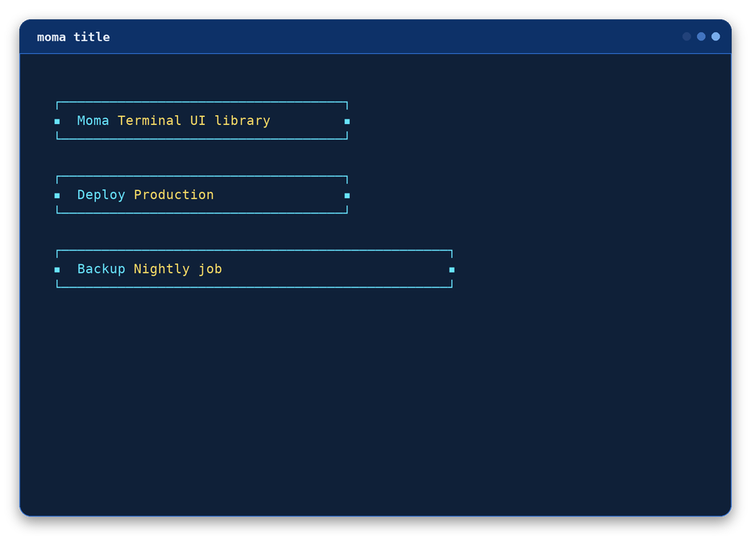

### `moma-title-sub`

Secondary heading for stages nested inside the main workflow.

```text
moma-title-sub "Deployment" "Production environment" [--width number] [--max-width number]
```

```bash
# Example 1
moma-title-sub "Dependencies" "Installing packages"

# Example 2
moma-title-sub "Deploy" "Production" --color cyan

# Example 3
moma-title-sub "Tests" --message "Running suite" --min-width 42
```

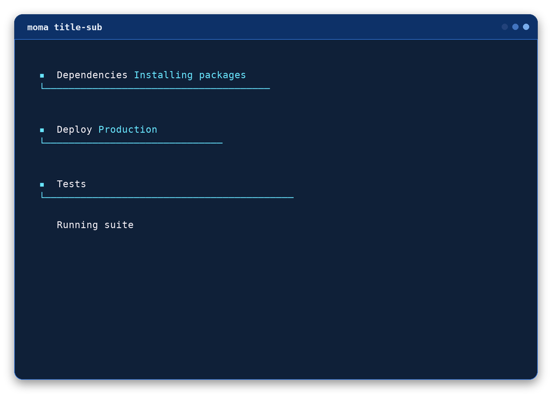

### `moma-section`

Strong separator that gives semantic context to the content that follows.

```text
moma-section "Dependencies ready" --success
```

```bash
# Example 1
moma-section "Dependencies ready" --success

# Example 2
moma-section "Configuration failed" --error

# Example 3
moma-section "Next step" --info --icon "→"
```

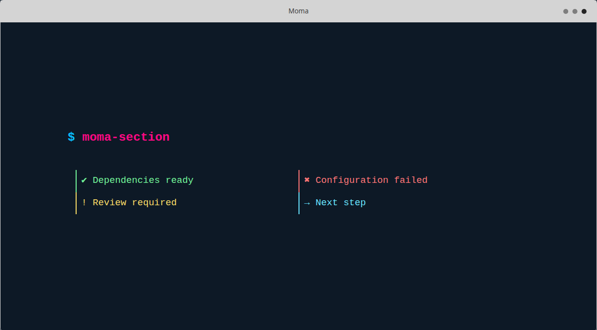

### `moma-msg`

Compact feedback with semantic defaults or custom color and icon overrides.

```text
moma-msg "Package installed" --success [--color value] [--icon value]
```

```bash
# Example 1
moma-msg "Package installed" --success

# Example 2
moma-msg "Connection refused" --error

# Example 3
moma-msg "Downloading metadata" --color cyan --icon "→"
```

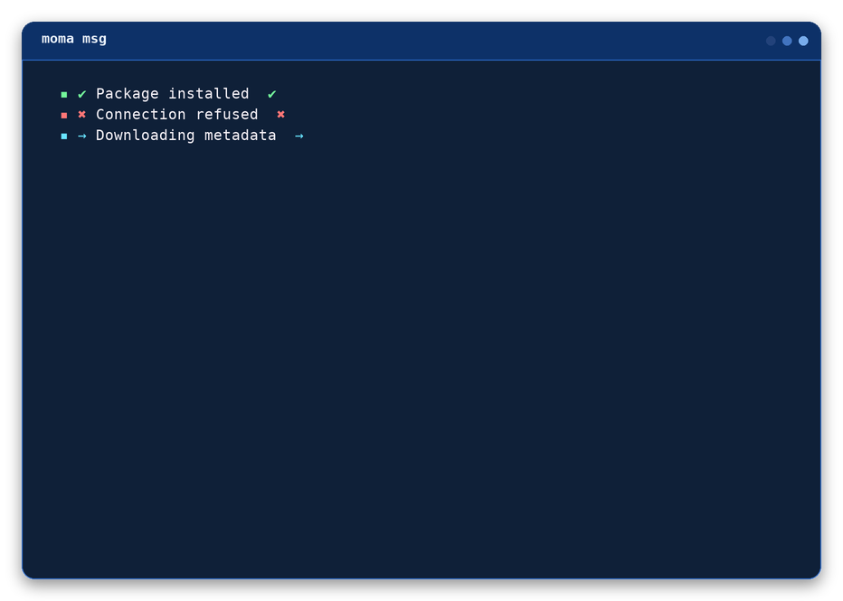

### `moma-msg-simple`

A quiet message with only a dot marker and no semantic icon.

```text
moma-msg-simple "Package installed" [--success|--error|--warning|--info] [--color value]
```

```bash
# Example 1
moma-msg-simple "Package installed"

# Example 2
moma-msg-simple "Package installation failed" --error

# Example 3
moma-msg-simple "Queued" --color yellow --marker "•"
```

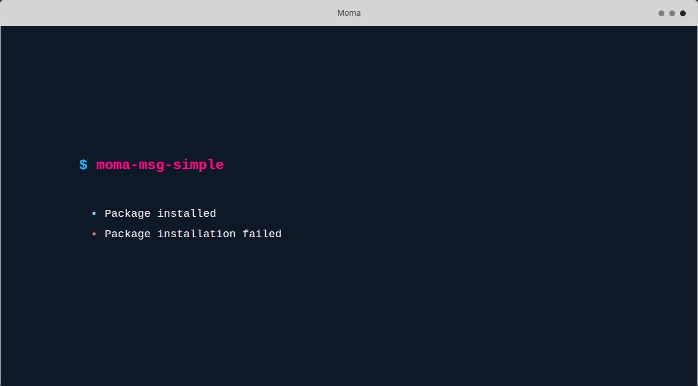

### `moma-list`

An unordered terminal list with a consistent marker for every item.

```text
moma-list "Clone repository" "Install dependencies" [--success|--error|--warning|--info]
```

```bash
# Example 1
moma-list "Clone repository" "Install dependencies" "Start application"

# Example 2
moma-list "Database ready" "Cache ready" --success

# Example 3
moma-list "Review logs" "Retry deployment" --marker "→" --color yellow
```

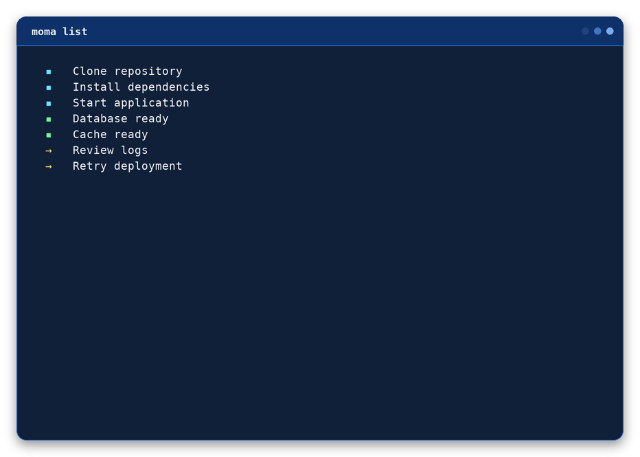

### `moma-box`

Framed notice for information that must stand apart from surrounding output.

```text
moma-box "Configuration is ready." --success [--width number] [--max-width number]
```

```bash
# Example 1
moma-box "Configuration is ready." --success

# Example 2
moma-box "Review the deployment settings." --warning --width 48

# Example 3
moma-box "Build failed." --error --icon "✖" --padding 2

# Same fixed width for multiple boxes
moma-box "Configuration is ready." --success --width 50
moma-box "Back up your files before continuing." --warning --width 50
```

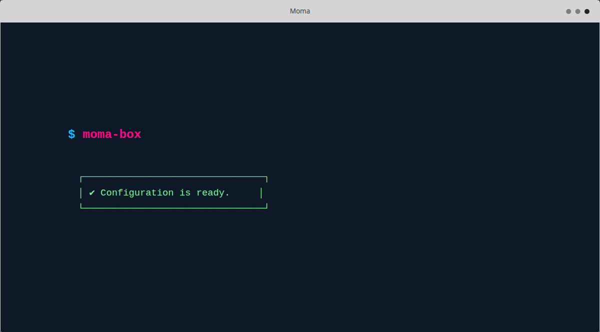

### `moma-prompt`

Question lead-in used before confirmation or free-form interaction.

```text
moma-prompt "Continue with the installation?" --color pink [--width number] [--max-width number]
```

```bash
# Example 1
moma-prompt "Continue with the installation?"

# Example 2
moma-prompt "Select an environment" --color cyan

# Example 3
moma-prompt "Deploy now?" --default "yes" --icon "?"
```

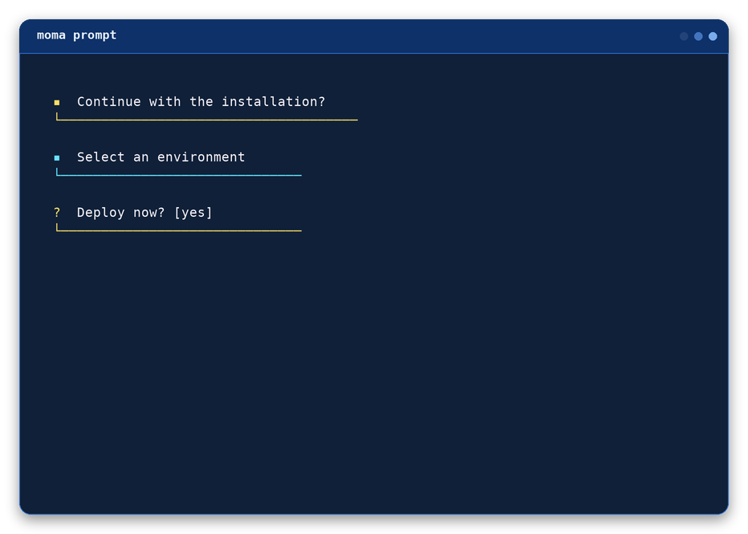

### `moma-label`

Print an input-style decorated label with automatic width, semantic color support, and one blank line below it.

```text
moma-label "TEXT HERE" [--width number] [--max-width number] [--color color] [--icon symbol]
```

```bash
# Example 1
moma-label "PROJECT NAME"

# Example 2
moma-label "DEPLOYMENT" --success

# Example 3
moma-label "NOTES" --width 52 --color cyan --icon "→"
```

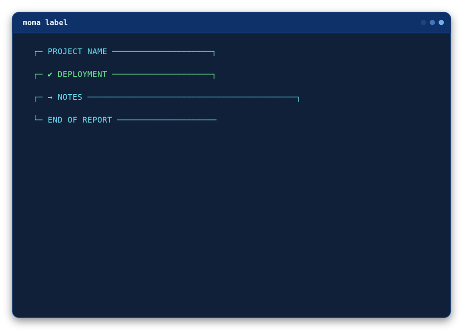

### `moma-rabbit`

Branded activity and completion feedback using Moma's rabbit signature.

```text
moma-rabbit "Preparing workspace" --info
```

```bash
# Example 1
moma-rabbit "Preparing workspace" --info

# Example 2
moma-rabbit "Deployment complete" --success

# Example 3
moma-rabbit "Build needs attention" --warning --icon "!"
```

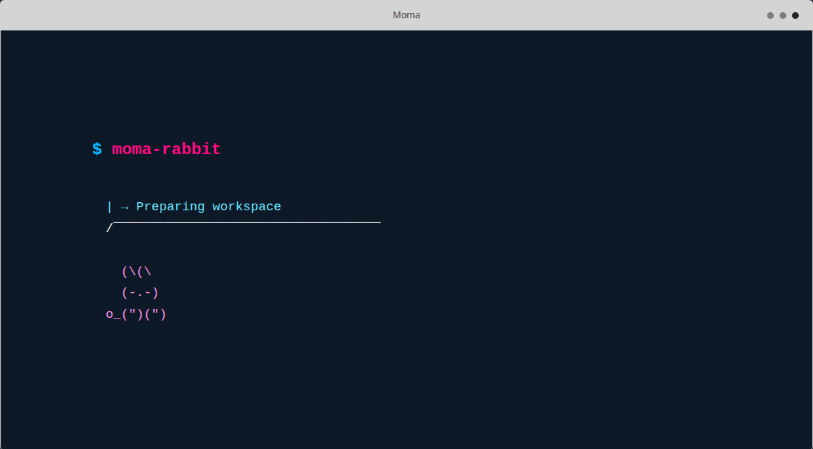

## Interactive components

### `moma-input`

Display or read a field with placeholders, validation, secret masking, and one blank line below each interactive value.

```text
moma-input --title "Project name" --read --required [--secret] [--mask symbol] [--default value] [--width number] [--max-width number]
```

```bash
# Example 1
moma-input --title "Project name" --placeholder "my-project"

# Example 2
project="$(moma-input --title "Project name" --read --required --trim)"

# Example 3
password="$(moma-input --title "Password" --read --secret --required)"
```

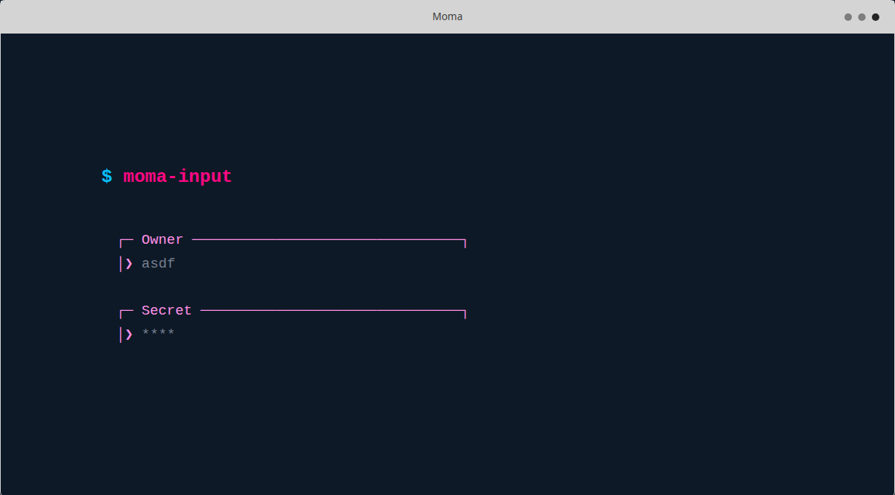

### `moma-single-select`

Select one value with the arrow keys, return it through standard output, and leave one blank line below the controls. Each row shows a radio indicator: `◉` for the focused selection and `○` for every other option.

```text
moma-single-select "Development" "Staging" "Production" [--title text] [--initial number]
```

```bash
# Example 1
environment="$(moma-single-select "Development" "Staging" "Production" --title "Environment")"

# Example 2
environment="$(moma-single-select "Development" "Staging" "Production" --choose 2)"

# Example 3
region="$(moma-single-select "US" "EU" "APAC" --title "Region" --initial 2 --color cyan)"
```

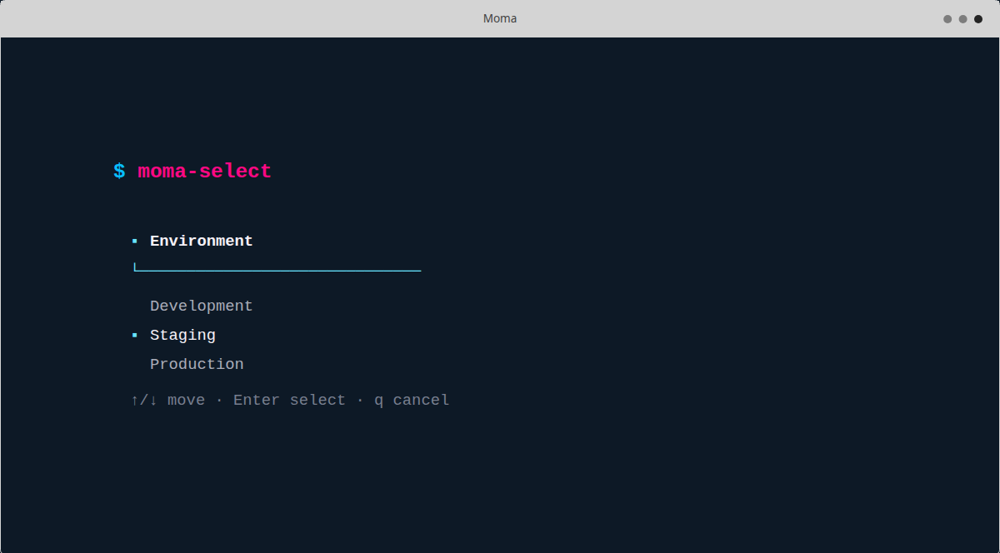

### `moma-select`

Documented compatibility alias for `moma-single-select`. It accepts the same arguments, renders identically, and remains available for existing scripts and the `select` CLI command.

```bash
environment="$(moma-select "Development" "Staging" "Production" --title "Environment")"
```

### `moma-single-select-groups`

Select one value organized under named, non-selectable group headings. Repeat `--group <name>` followed by one or more `--option <value>` pairs; `--initial` and `--choose` use one-based indexes that count only options, in visual order across every group.

```text
moma-single-select-groups --title text (--group name --option value...)... [--initial number] [--choose number]
```

```bash
# Example 1
action="$(
  moma-single-select-groups \
    --title "Features" \
    --group "Docker" --option "Up" --option "Down" --option "Stop" \
    --group "npm" --option "install" --option "run dev" --option "run deploy"
)"

# Example 2 (--choose 4 selects "install", the first option of the second group)
action="$(
  moma-single-select-groups \
    --title "Features" \
    --group "Docker" --option "Up" --option "Down" --option "Stop" \
    --group "npm" --option "install" --option "run dev" --option "run deploy" \
    --choose 4
)"
```

### `moma-multi-select`

Toggle multiple values below a decorated Moma heading and return every selection on its own line, in original visual order. Each row shows a checkbox indicator: `▣` when selected and `□` when not.

```text
moma-multi-select "Docker" "CI" "Tests" [--selected 1,3] [--required]
```

```bash
# Example 1
features="$(moma-multi-select "Docker" "CI" "Tests" --title "Features")"

# Example 2
features="$(moma-multi-select "Docker" "CI" "Tests" --choose 1,3)"

# Example 3
features="$(moma-multi-select "Docker" "CI" "Tests" --selected 1,2 --required)"
```

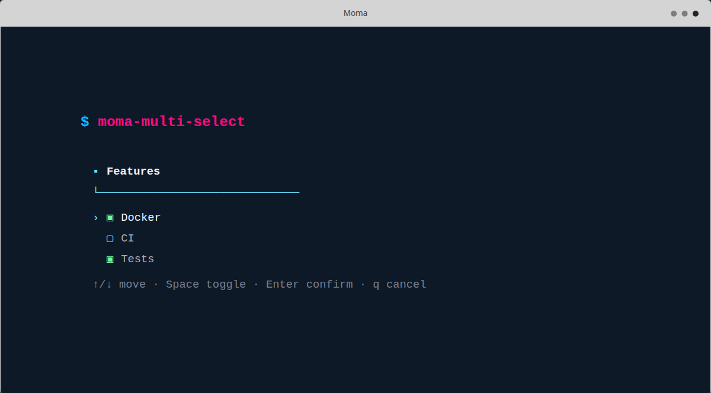

### `moma-multi-select-groups`

Toggle multiple values organized under named, non-selectable group headings and return every selection on its own line, in original visual order. Repeat `--group <name>` followed by one or more `--option <value>` pairs; `--selected` and `--choose` use comma-separated, one-based indexes that count only options, in visual order across every group.

```text
moma-multi-select-groups --title text (--group name --option value...)... [--selected numbers] [--choose numbers] [--required]
```

```bash
# Example 1
countries="$(
  moma-multi-select-groups \
    --title "Features" \
    --group "North America" --option "United States" --option "Canada" --option "Mexico" \
    --group "South America" --option "Colombia" --option "Argentina" --option "Peru"
)"

# Example 2
countries="$(
  moma-multi-select-groups \
    --title "Features" \
    --group "North America" --option "United States" --option "Canada" --option "Mexico" \
    --group "South America" --option "Colombia" --option "Argentina" --option "Peru" \
    --choose 1,3 --required
)"
```

### `moma-confirm`

Select Yes or No with the arrow keys, Enter, or the y and n shortcuts. A successful answer leaves one blank line below the controls.

```text
moma-confirm "Create this project?" [--default yes|no] [--answer yes|no]
```

```bash
# Example 1
moma-confirm "Create this project?" --default yes

# Example 2
moma-confirm "Delete the cache?" --answer no

# Example 3
if moma-confirm "Deploy now?"; then
  moma-msg "Deploying" --info
fi
```

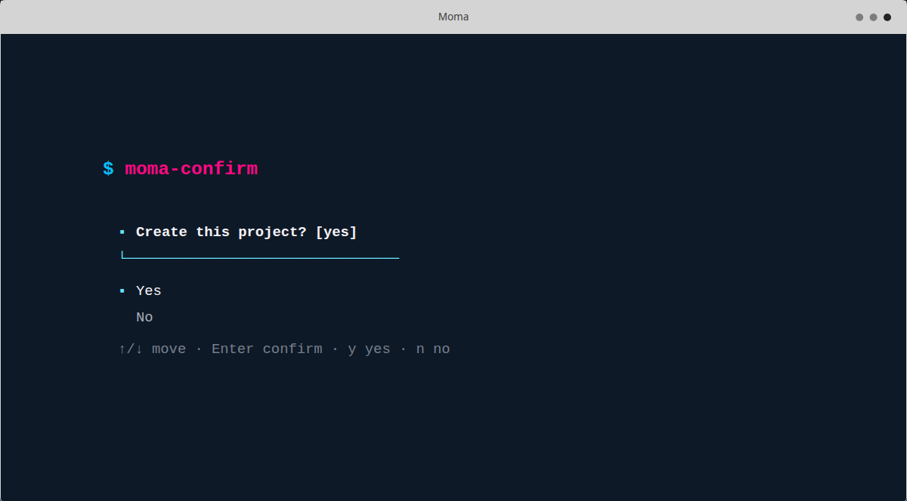

## Workflow helpers

### `moma-spinner`

Display progress while a process is active, then print semantic completion feedback.

```text
moma-spinner pid ["message"] [--delay seconds]
```

```bash
# Example 1
sleep 2 &
moma-spinner "$!" "Waiting"

# Example 2
backup_database &
moma-spinner --pid "$!" --message "Backing up"

# Example 3
build_project &
moma-spinner "$!" "Building" --delay 0.05
```

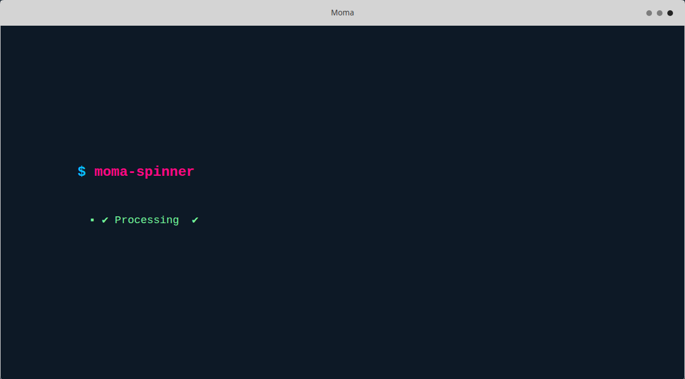

### `moma-command-check`

Check whether every requested executable is available and return a useful status.

```text
moma-command-check bash curl git [--quiet]
```

```bash
# Example 1
moma-command-check bash curl git

# Example 2
moma-command-check docker --quiet

# Example 3
if ! moma-command-check git; then
  exit 1
fi
```

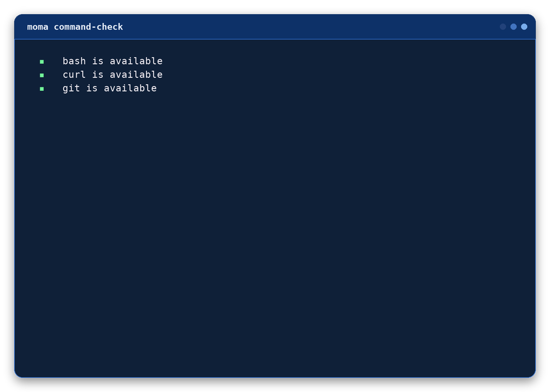

## Semantic styles

| Flag | Default color | Default icon |
| --- | --- | --- |
| `--success` | Green | `✔` |
| `--error` | Red | `✖` |
| `--warning` | Yellow | `!` |
| `--info` | Cyan | `→` |

## Preview commands

```bash
./dist/moma preview
./dist/moma preview md
./dist/moma preview web
./dist/moma help
```

## Version and updates

```bash
./dist/moma version
./dist/moma update
```

`update` downloads the latest executable, validates it, and atomically replaces
the current executable. It requires `curl` and write permission for the installed
file and its directory.

## Remote preview

```bash
bash <(curl -fsSL https://raw.githubusercontent.com/Mgldvd/moma/master/dist/moma) preview
```
